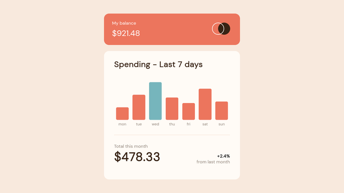
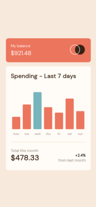

# Frontend Mentor - Expenses chart component solution

This is a solution to the [Expenses chart component challenge on Frontend
Mentor](https://www.frontendmentor.io/challenges/expenses-chart-component-e7yJBUdjwt).
Frontend Mentor challenges help you improve your coding skills by building
realistic projects.

## Table of contents

- [Overview](#overview)
  - [The challenge](#the-challenge)
  - [Links](#links)
  - [Screenshot](#screenshot)
- [My process](#my-process)
  - [Built with](#built-with)
  - [What I learned](#what-i-learned)
  - [Continued development](#continued-development)
- [Author](#author)

## Overview

### The challenge

Users should be able to:

- View the bar chart and hover over the individual bars to see the correct amounts for each day
- See the current day’s bar highlighted in a different color to the other bars
- View the optimal layout for the content depending on their device’s screen size
- See hover states for all interactive elements on the page
- **Bonus**: Use the JSON data file provided to dynamically size the bars on the chart [Bonus condition met ;) ]

### Links

- Solution URL: [GitHub Repo](https://github.com/bradleyhop/frontend-mentor-expenses-chart-component)
- Live Site URL: [Via GitHub Pages](https://bradleyhop.github.io/frontend-mentor-expenses-chart-component/)

### Screenshot




## My process

### Built with

- Semantic HTML5 markup
- [SCSS](https://sass-lang.com/)
- [Vue.js](https://vuejs.org/) - JS library
- [Vite](https://vitejs.dev) - Next generation frontend tooling

### What I learned

I did not want to use a library to draw the chart for this project. The design
and data did not seem complex, so I challenged myself to use only CSS and
Javascript.

I dynamically draw the bars on the chart so that the height reflexes the value.
At the same time, I needed to check if that value was the max value to apply
custom CSS to that particular element. I also need to assign a value to a
custom HTML Attribute for each bar, which draws the tooltip elements on
hovering a bar. Vue.js made all this mostly painless:

```html
    <div
      v-for="expense in expJSON"
      :key="expense.id"
      class="bar-chart-container__bar"
      :style="{
        height: `${(expense.amount / maxExpense) * 150}px`
      }"
      :class="`${expense.amount === maxExpense ? 'max' : ''}`"
      :data-exp-amount="`${'$'.concat(expense.amount)}`"
    ></div>
```

The code for the tooltip:

```scss
.bar-chart-container__bar {
  //[...]

  // tooltip construction; no styling for mobile
  &::before {
    content: attr(data-exp-amount);
    color: $cardWhite;
    background-color: $darkBrown;
    border-radius: 5px;
    opacity: 0;
    padding: 8px;
    // positioning
    position: absolute;
    top: -42px;
    left: 50%;
    transform: translateX(-50%);
    transition: opacity $transition-type;
  }

  // show tooltip
  &:hover::before {
    opacity: 1;
  }
}
```

After running the app through `html-validator`, I found a new issue: my custom
attribute did not have the proper naming scheme. I fixed it by simply prepending
`data-` to my custom attribute name in the HTML and CSS code.

### Continued development

I used the exact pixel measurement given in the challenge description for the
desktop and mobile screens. I want to be better able to capture the spirit of
the design documents and use CSS features such as `clamp()` to help make
responsive components.

## Author

- Website - [Bradley Smith](https://www.bradleysmith.tech)
- Frontend Mentor -
    [@bradleyhop](https://www.frontendmentor.io/profile/bradleyhop)

